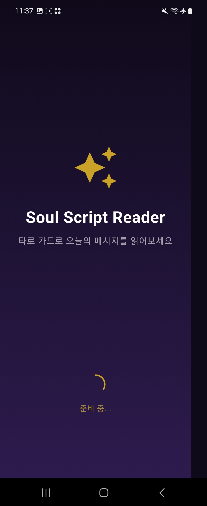
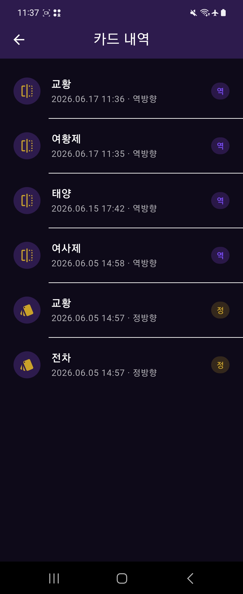
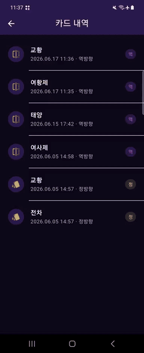

# Soul Script Reader

타로 카드를 뽑아 해석을 읽고, 뽑은 기록을 MySQL에 저장·조회하는 Flutter 포트폴리오 앱입니다.

## 주요 기능

- 메이저 아르카나 22장 타로 카드 랜덤 뽑기 (정/역 방향)
- 카드별 한글 해석 제공
- 뽑기 히스토리 저장 및 목록 조회
- Pull-to-refresh로 내역 갱신

## 기술 스택

| 영역         | 기술                                              |
| ------------ | ------------------------------------------------- |
| 클라이언트   | Flutter, Riverpod, go_router, Dio, freezed        |
| 서버         | Dart shelf, mysql_client_plus                     |
| 데이터베이스 | MySQL 8.4 LTS                                     |
| 아키텍처     | Clean Architecture (domain / data / presentation) |

## 스크린샷

|                 Splash                 |                Main                |                Draw                |                 History                  |
| :------------------------------------: | :--------------------------------: | :--------------------------------: | :--------------------------------------: |
|  |  |  |  |

### 동작 미리보기

카드 뽑기·내역 화면의 실제 동작입니다. (GIF, 자동 반복)

|  |  |
| :---------------------------------------------------: | :---------------------------------------------------------: |

원본 영상(MP4)은 [`docs/screenrecordings/`](docs/screenrecordings/)에서 확인할 수 있습니다.

## 프로젝트 구조

```
soul_script_reader/
├── lib/                  # Flutter 앱
│   ├── app/              # 라우터, 테마
│   ├── core/             # 네트워크, 에러, 상수
│   ├── domain/           # Entity, Repository, UseCase
│   ├── data/             # Model, DataSource, Repository 구현
│   └── presentation/     # 화면, Provider
├── server/               # REST API + SQL
│   ├── bin/server.dart
│   └── sql/
├── docs/                 # 설계 문서
├── .env.example          # Flutter 환경 변수 템플릿
└── pubspec.yaml
```

## 사전 요구사항

- Flutter SDK 3.38+
- Dart SDK 3.10+
- MySQL 8.4 LTS (Homebrew: `brew install mysql@8.4`)

## 빠른 시작

### 1. 저장소 클론 및 의존성 설치

```bash
git clone <repository-url>
cd soul_script_reader
flutter pub get
dart run build_runner build --delete-conflicting-outputs
```

### 2. MySQL 8.4 LTS 설치 및 마이그레이션

```bash
# macOS Homebrew (LTS 버전 사용 — brew install mysql 은 9.x Innovation)
brew install mysql@8.4
brew link mysql@8.4 --force
brew services start mysql@8.4
```

```bash
# MySQL 사용자·DB 생성 (최초 1회)
mysql -u root -p

CREATE USER 'soul_app'@'localhost' IDENTIFIED BY 'your_password';
GRANT ALL PRIVILEGES ON soul_script_reader.* TO 'soul_app'@'localhost';
FLUSH PRIVILEGES;
EXIT;

# 스키마 및 시드 데이터 적용
mysql -u root -p < server/sql/schema.sql
mysql -u root -p < server/sql/seed_major_arcana.sql
```

적용 후 `tarot_cards`(22장), `draw_history` 테이블이 생성됩니다.

### 3. API 서버 실행

```bash
cd server
cp .env.example .env
# .env 에 MYSQL_PASSWORD 등 설정

dart pub get
dart run bin/server.dart
```

서버: `http://127.0.0.1:8080`  
헬스 체크: `GET /health`

자세한 API 명세는 [server/README.md](server/README.md)를 참고하세요.

### 4. Flutter 환경 변수 설정

```bash
cd ..   # 프로젝트 루트
cp .env.example .env
```

`.env` 예시:

```env
# iOS 시뮬레이터 / macOS
API_BASE_URL=http://127.0.0.1:8080

# Android 에뮬레이터 사용 시 아래로 변경
# API_BASE_URL=http://10.0.2.2:8080
```

### 5. Flutter 앱 실행

```bash
flutter run
```

## 화면 흐름

```
Splash → Main → Draw (카드 뽑기 / 저장)
              → History (내역 조회)
```

## API 엔드포인트 요약

| Method | Path                   | 설명              |
| ------ | ---------------------- | ----------------- |
| GET    | `/api/v1/cards/random` | 랜덤 카드 + 정/역 |
| GET    | `/api/v1/history`      | 히스토리 목록     |
| POST   | `/api/v1/history`      | 히스토리 저장     |

## 테스트

```bash
flutter analyze
flutter test
```

### 테스트 구조

```
test/
├── helpers/           # fixtures, fakes
├── core/              # error_mapper, date_formatter
├── domain/            # Entity
├── data/              # Model, Repository
├── presentation/      # Notifier (draw, history, splash)
└── widget_test.dart   # 앱 부팅 위젯 테스트
```

## 문서

- [앱 설계서](docs/DESIGN.md)
- [단계별 구현 프롬프트](docs/IMPLEMENTATION_PROMPTS.md)
- [API 서버 가이드](server/README.md)

## 라이선스

포트폴리오용 개인 프로젝트입니다.
