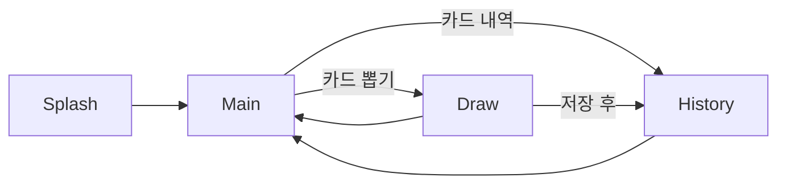

# Soul Script Reader — 앱 설계서

> 타로 카드를 뽑아 해석을 보고, 뽑은 기록을 MySQL에 저장·조회하는 포트폴리오 앱  
> 클라이언트: **Flutter** (`soul_script_reader`) · 데이터: **MySQL**

---

## 1. 앱 개요

| 항목 | 내용 |
|------|------|
| 앱명 | Soul Script Reader |
| 목적 | 타로 카드 1장(또는 스프레드 확장 가능)을 뽑고, 카드 의미(해석)를 제공하며, 뽑은 결과를 히스토리로 저장·열람 |
| 플랫폼 | iOS / Android (Flutter) |
| 데이터 저장 | MySQL — 카드 마스터 데이터 + 뽑기 히스토리 |

### 사용자 플로우



---

## 2. 화면 구성 (4개)

| # | 화면 | 경로(예시) | 역할 |
|---|------|------------|------|
| 1 | Splash | `/` | 앱 로고·브랜딩, 초기화( DB/API 연결 확인 ), 2~3초 후 메인으로 이동 |
| 2 | 메인 | `/main` | 「카드 뽑기」「카드 내역」 네비게이션 버튼 |
| 3 | 카드 뽑기 | `/draw` | 덱에서 카드 1장 뽑기 → 앞/뒤(정/역) 표시 → 해석 텍스트 → 히스토리 저장 |
| 4 | 카드 내역 | `/history` | 과거 뽑기 목록(날짜·카드명·정/역) → 탭 시 상세 |

---

## 3. 기술 스택

### 3.1 클라이언트 (Flutter)

| 영역 | 권장 패키지 | 용도 |
|------|-------------|------|
| 라우팅 | `go_router` | 선언적 경로, Splash → Main 전환 |
| 상태관리 | `flutter_riverpod` | 화면별 Provider, UseCase 주입 |
| HTTP | `dio` | REST API 호출 |
| 직렬화 | `freezed` + `json_serializable` | Model / Entity 매핑 |
| 환경변수 | `flutter_dotenv` | API Base URL (개발/운영 분리) |
| 날짜 | `intl` | 히스토리 날짜 포맷 |

### 3.2 백엔드 · MySQL (권장)

모바일 앱에서 MySQL에 **직접** 연결하는 방식은 보안·방화벽 이슈로 포트폴리오에서도 비권장입니다.  
**REST API + MySQL** 구조를 기본으로 설계합니다.

| 옵션 | 설명 |
|------|------|
| **A (권장)** | Dart `shelf` API 서버 + `mysql_client_plus` + **MySQL 8.4 LTS** |
| B (로컬 데모만) | Flutter `mysql_client` — 개발 PC에서만 동작, 배포용 아님 |

본 설계는 **옵션 A** 기준입니다. Repository는 HTTP DataSource만 알고, MySQL 스키마는 API 서버가 담당합니다.

---

## 4. 클린 아키텍처 레이어

```
lib/
├── main.dart
├── app/                          # 앱 진입·전역 설정
│   ├── app.dart
│   ├── router/app_router.dart
│   └── theme/app_theme.dart
├── core/
│   ├── constants/                # API 경로, 앱 상수
│   ├── errors/                   # Failure, Exception 매핑
│   ├── network/                  # Dio 클라이언트, 인터셉터
│   └── utils/                    # 날짜, 랜덤 시드 등
├── domain/                       # 비즈니스 규칙 (프레임워크 무관)
│   ├── entities/
│   │   ├── tarot_card.dart
│   │   └── draw_record.dart
│   ├── repositories/             # abstract interface
│   │   ├── tarot_repository.dart
│   │   └── history_repository.dart
│   └── usecases/
│       ├── draw_random_card.dart
│       ├── save_draw_history.dart
│       ├── get_draw_history.dart
│       └── get_tarot_card_by_id.dart
├── data/
│   ├── models/                   # JSON ↔ Entity 변환
│   │   ├── tarot_card_model.dart
│   │   └── draw_record_model.dart
│   ├── datasources/
│   │   ├── tarot_remote_datasource.dart
│   │   └── history_remote_datasource.dart
│   └── repositories/             # interface 구현체
│       ├── tarot_repository_impl.dart
│       └── history_repository_impl.dart
└── presentation/
    ├── providers/                # Riverpod providers
    ├── common/widgets/           # 공통 버튼, 로딩, 에러 뷰
    ├── splash/
    ├── main/
    ├── draw/
    └── history/
```

### 의존성 방향

```
presentation → domain ← data
                  ↑
            (entities, usecases, repo interface)
```

- **presentation**: UI만, UseCase / Provider 호출
- **domain**: Entity, Repository **interface**, UseCase
- **data**: Model, RemoteDataSource, Repository **impl**

---

## 5. MySQL 스키마

```sql
-- 카드 마스터 (78장 타로 또는 MVP 22장 메이저 아르카나)
CREATE TABLE tarot_cards (
  id            INT UNSIGNED AUTO_INCREMENT PRIMARY KEY,
  code          VARCHAR(32) NOT NULL UNIQUE COMMENT 'e.g. major_00_fool',
  name_en       VARCHAR(64) NOT NULL,
  name_ko       VARCHAR(64) NOT NULL,
  arcana        ENUM('major', 'minor') NOT NULL DEFAULT 'major',
  suit          VARCHAR(16) NULL COMMENT 'cups, wands, swords, pentacles',
  number        TINYINT UNSIGNED NULL,
  image_url     VARCHAR(512) NULL,
  meaning_upright   TEXT NOT NULL,
  meaning_reversed  TEXT NOT NULL,
  created_at    TIMESTAMP DEFAULT CURRENT_TIMESTAMP,
  updated_at    TIMESTAMP DEFAULT CURRENT_TIMESTAMP ON UPDATE CURRENT_TIMESTAMP,
  INDEX idx_arcana (arcana)
) ENGINE=InnoDB DEFAULT CHARSET=utf8mb4;

-- 뽑기 히스토리
CREATE TABLE draw_history (
  id            BIGINT UNSIGNED AUTO_INCREMENT PRIMARY KEY,
  card_id       INT UNSIGNED NOT NULL,
  is_reversed   TINYINT(1) NOT NULL DEFAULT 0,
  drawn_at      DATETIME NOT NULL DEFAULT CURRENT_TIMESTAMP,
  note          VARCHAR(255) NULL,
  FOREIGN KEY (card_id) REFERENCES tarot_cards(id) ON DELETE RESTRICT,
  INDEX idx_drawn_at (drawn_at DESC)
) ENGINE=InnoDB DEFAULT CHARSET=utf8mb4;
```

### 시드 데이터 (MVP)

- 최소 **22장 메이저 아르카나** INSERT 스크립트 (`server/sql/seed_major_arcana.sql`)
- 포트폴리오 확장 시 78장 전체 시드 추가

---

## 6. REST API 명세 (예시)

Base URL: `{API_BASE}/api/v1`

| Method | Path | 설명 | Response |
|--------|------|------|----------|
| GET | `/cards` | 전체 카드 목록 | `{ "data": [ TarotCard ] }` |
| GET | `/cards/:id` | 카드 1장 | `{ "data": TarotCard }` |
| GET | `/cards/random` | 서버 랜덤 1장 + `is_reversed` | `{ "data": { "card": TarotCard, "is_reversed": bool } }` |
| GET | `/history` | 히스토리 목록 `?limit=50&offset=0` | `{ "data": [ DrawRecord ] }` |
| POST | `/history` | 히스토리 저장 | Body: `{ "card_id", "is_reversed", "note?" }` |

### JSON 필드 (클라이언트 Model과 동일)

**TarotCard**

```json
{
  "id": 1,
  "code": "major_00_fool",
  "name_en": "The Fool",
  "name_ko": "바보",
  "arcana": "major",
  "suit": null,
  "number": 0,
  "image_url": "/assets/cards/00_fool.png",
  "meaning_upright": "...",
  "meaning_reversed": "..."
}
```

**DrawRecord**

```json
{
  "id": 101,
  "card_id": 1,
  "card": { /* TarotCard embed 또는 id만 */ },
  "is_reversed": false,
  "drawn_at": "2026-06-05T14:30:00Z",
  "note": null
}
```

---

## 7. 도메인 규칙

| UseCase | 입력 | 출력 | 비고 |
|---------|------|------|------|
| `DrawRandomCard` | — | `DrawResult(card, isReversed)` | API `/cards/random` 또는 클라이언트 셔플(서버 권장) |
| `SaveDrawHistory` | `cardId`, `isReversed`, `note?` | `DrawRecord` | POST `/history` |
| `GetDrawHistory` | `limit`, `offset` | `List<DrawRecord>` | 최신순 |
| `GetTarotCardById` | `id` | `TarotCard` | 상세 화면용 |

**정/역 카드**: `is_reversed == false` → `meaning_upright`, `true` → `meaning_reversed`

---

## 8. 화면별 UI·상태 요약

### 8.1 Splash

- 표시: 앱 타이틀, 서브 카피, 로딩 인디케이터
- 로직: `AppInitializer` — dotenv 로드, API health check(optional)
- 2초 후 `context.go('/main')` (또는 health 실패 시 스낵바 + 재시도)

### 8.2 메인

- 두 개의 Primary 버튼: `카드 뽑기` → `/draw`, `카드 내역` → `/history`
- AppBar: 앱 이름, 테마 일관

### 8.3 카드 뽑기

- 상태: `idle` → `drawing`(애니메이션) → `revealed` → `saving` → `saved`
- UI: 카드 뒷면 탭/버튼으로 뽑기 → 플립 애니메이션 → 이름·정/역 뱃지·해석 스크롤
- CTA: 「히스토리에 저장」「다시 뽑기」「내역 보기」

### 8.4 카드 내역

- `ListView` + `RefreshIndicator`
- 아이템: 날짜, `name_ko`, 정/역 아이콘, 썸네일(optional)
- 탭: BottomSheet 또는 `/history/:id` 상세

---

## 9. 테마·UX 가이드 (포트폴리오)

| 토큰 | 값(예시) |
|------|----------|
| Primary | `#2D1B4E` (딥 퍼플) |
| Accent | `#C9A227` (골드) |
| Background | `#0F0A1A` |
| Surface | `#1A1228` |
| Font | 기본 Material + 추후 `Cinzel` / `Noto Sans KR` |

- 다크 테마 기본 (타로 무드)
- 버튼·카드에 subtle gradient / shadow

---

## 10. 환경·설정

`.env.example` (저장소에 커밋, `.env`는 gitignore):

```env
API_BASE_URL=http://10.0.2.2:8080   # Android 에뮬레이터 → host machine
# iOS 시뮬레이터: http://127.0.0.1:8080
```

`server/.env.example`:

```env
MYSQL_HOST=127.0.0.1
MYSQL_PORT=3306
MYSQL_USER=soul_app
MYSQL_PASSWORD=
MYSQL_DATABASE=soul_script_reader
PORT=8080
```

---

## 11. 디렉터리 (저장소 루트)

```
soul_script_reader/
├── docs/
│   ├── DESIGN.md                 # 본 문서
│   └── IMPLEMENTATION_PROMPTS.md # 단계별 Cursor 프롬프트
├── lib/                            # Flutter (위 4절 구조)
├── server/                         # (권장) API + SQL
│   ├── sql/
│   │   ├── schema.sql
│   │   └── seed_major_arcana.sql
│   └── README.md
├── assets/
│   └── cards/                      # 카드 이미지 (optional)
├── .env.example
└── pubspec.yaml
```

---

## 12. 구현 단계 요약

| 단계 | 범위 | 산출물 |
|------|------|--------|
| **1** | 앱 골격 | 폴더 구조, `go_router`, theme, 빈 4화면, `main.dart` 정리 |
| **2** | 클린 아키텍처 코어 | Entity, Model, DataSource, Repository, UseCase, Provider, API·SQL 스텁 |
| **3-A** | Splash 페이지 | UI + 초기화 + 자동 라우팅 |
| **3-B** | 메인 페이지 | 네비게이션 버튼 |
| **3-C** | 카드 뽑기 페이지 | 뽑기·해석·저장 플로우 |
| **3-D** | 카드 내역 페이지 | 목록·상세·새로고침 |

각 단계의 **복사용 프롬프트**는 [`IMPLEMENTATION_PROMPTS.md`](./IMPLEMENTATION_PROMPTS.md)를 사용합니다.

---

## 13. 완료 기준 (Definition of Done)

- [x] 4개 화면 라우팅 연결
- [x] MySQL에 `tarot_cards`, `draw_history` 테이블 및 시드 존재
- [x] API를 통해 랜덤 뽑기·히스토리 CRUD 동작
- [x] 뽑은 카드가 히스토리 목록에 표시
- [x] `flutter analyze` 경고 없음
- [x] README에 실행 방법(API, DB, Flutter) 문서화

---

## 14. 리스크·결정 사항

| 이슈 | 결정 |
|------|------|
| MySQL 직접 연결 vs API | **API + MySQL** (포트폴리오·보안) |
| 랜덤 위치 | **서버** `/cards/random` (공정성·일관성) |
| MVP 카드 수 | 22 메이저 → 이후 78장 확장 |
| 오프라인 | 1차 범위 제외; 2차에서 local cache 고려 |

---

*문서 버전: 1.0 · 프로젝트: soul_script_reader*
